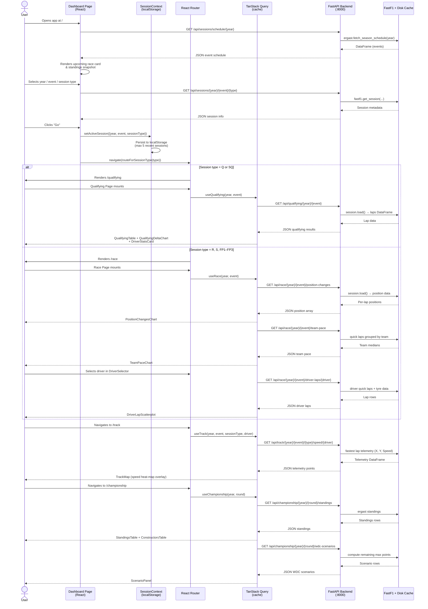

# Cloud Architecture Overview

F1 Console is a full-stack web application. The frontend is a Vite-powered React SPA; the backend is a FastAPI service that wraps the [FastF1](https://docs.fastf1.dev/) Python library. All F1 telemetry and session data is sourced from the Ergast/FastF1 data pipeline at request time and cached on disk.

## Component Map

```
┌─────────────────────────────────────────────────┐
│                   Browser (SPA)                 │
│  React 19 · React Router v7 · MUI v5 · Nivo     │
│  TanStack Query · Tailwind CSS                  │
└────────────────────┬────────────────────────────┘
                     │  HTTP/JSON  (localhost:3000 → :8000)
                     ▼
┌─────────────────────────────────────────────────┐
│             FastAPI Backend  :8000              │
│  /api/sessions  /api/race  /api/qualifying      │
│  /api/lap-times  /api/track  /api/championship  │
└────────────────────┬────────────────────────────┘
                     │  Python SDK
                     ▼
┌─────────────────────────────────────────────────┐
│              FastF1 Library (3.5)               │
│  Ergast API  ·  Timing / Telemetry feeds        │
│  Disk cache  (.fastf1_cache/)                   │
└─────────────────────────────────────────────────┘
```

---

## User Journey — Session Selection to Data View

The sequence below traces the complete path from a user landing on the Dashboard to a fully rendered data page.



---

## Data Caching Strategy

| Layer | Mechanism | Notes |
|-------|-----------|-------|
| FastF1 disk cache | `.fastf1_cache/` directory | Persists raw timing / telemetry; avoids re-fetching from Ergast |
| TanStack Query | In-memory per client tab | `staleTime` keeps data fresh for the browser session; avoids redundant API calls |
| Browser localStorage | `f1.recentSessions` key | Stores up to 5 recent session selections across page reloads |

---

## API Endpoint Reference

| Method | Path | Description |
|--------|------|-------------|
| GET | `/health` | Liveness check |
| GET | `/api/sessions/schedule/{year}` | Full season event schedule |
| GET | `/api/sessions/{year}/{event}/{type}` | Session metadata |
| GET | `/api/qualifying/{year}/{event}` | Qualifying results + delta to pole |
| GET | `/api/race/{year}/{event}/position-changes` | Per-lap race positions |
| GET | `/api/race/{year}/{event}/team-pace` | Team median lap times |
| GET | `/api/race/{year}/{event}/driver-laps/{driver}` | Driver quick laps + tyre data |
| GET | `/api/lap-times/{year}/{event}/{type}/comparison` | Multi-driver lap time comparison |
| GET | `/api/track/{year}/{event}/{type}/speed/{driver}` | Fastest-lap telemetry for track map |
| GET | `/api/track/{year}/{event}/{type}/{driver}/lap/{lap}` | Per-lap telemetry |
| GET | `/api/track/{year}/{event}/corners` | Circuit corner annotations |
| GET | `/api/championship/{year}/{round}/standings` | Driver + constructor standings |
| GET | `/api/championship/{year}/{round}/wdc-scenarios` | Remaining WDC title contenders |
